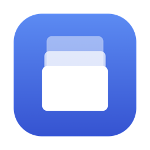

<div align="center">



# clipstack

**Менеджер буфера обмена для macOS**

Живёт в меню-баре, помнит историю копий, вставляет выбранное прямо в активное окно.

*A native clipboard manager and clipboard history app for macOS — search, pin, and paste
straight into the active window. Written in Swift with no third-party dependencies.*

[](https://github.com/roviver/ClipStack/releases/latest)

</div>

## Установка

Скачай [`.dmg` из последнего релиза](https://github.com/roviver/ClipStack/releases/latest),
открой и перетащи приложение в Applications.

При первом запуске macOS скажет, что разработчик не проверен — приложение подписано
самоподписанным сертификатом, без платного Apple Developer Program. Открой его правым
кликом → «Открыть» и подтверди один раз.

Чтобы работала вставка в активное окно, выдай доступ:
**Системные настройки → Конфиденциальность и безопасность → Универсальный доступ**.
Без него всё работает, кроме автовставки — элемент просто ложится в буфер.

## Как пользоваться

| Действие | Клавиши |
| --- | --- |
| Показать историю | ⇧⌘V (меняется в настройках) |
| Выбрать и вставить | ↑ ↓, затем ↩ |
| Взять одну из первых девяти | ⌘1 … ⌘9 |
| Прыгнуть на десять строк | Page Up / Page Down |
| Закрепить или открепить | ⌘P |
| Удалить запись | ⌘⌫ |
| Закрыть панель | Esc |

Поиск — просто начни печатать, поле уже в фокусе. Фильтры под поиском отбирают по типу
(текст, ссылки, картинки, файлы, цвета) и показывают закреплённые.

Закреплённые записи не вытесняются при переполнении истории и в лимит не входят.

## Приватность

Копии, помеченные приложением как секретные, не сохраняются **никогда** — этим маркером
(`org.nspasteboard.ConcealedType`) менеджеры паролей просят не запоминать содержимое.
Отдельные приложения можно занести в игнор-лист в настройках.

История лежит в `~/Library/Application Support/clipstack/` — только на твоём компьютере,
никуда не отправляется, никакой сети приложение не касается вообще.

## Сборка из исходников

Xcode не нужен, достаточно Command Line Tools.

```bash
./Scripts/make-cert.sh   # один раз: самоподписанный сертификат
./Scripts/make-icon.sh   # один раз: иконка приложения
./Scripts/install.sh     # сборка и установка в /Applications
./Scripts/make-dmg.sh    # собрать образ для распространения
```

Сертификат нужен не для красоты: macOS привязывает выданное разрешение Универсального
доступа к подписи приложения. При ad-hoc подписи оно слетает после каждой пересборки.

## Как устроено

* **Swift 6** со строгой конкурентностью. Каркас на AppKit, содержимое окон на SwiftUI:
  менеджеру буфера нужен жёсткий контроль фокуса окна, иначе ломается автовставка.
* **Ноль внешних зависимостей.** SQLite берётся системный через C API, глобальный хоткей —
  через Carbon.
* Буфер опрашивается по таймеру: у `NSPasteboard` нет уведомлений об изменениях, это
  единственный доступный способ.
* Вставка работает так: приложение запоминает, какое окно было активным до открытия панели,
  затем возвращает ему фокус и синтезирует ⌘V.

## Ограничения

* Хранится только текст без форматирования — RTF и HTML теряются.
* Синхронизации с iPhone нет: она требует платного Apple Developer Program.
* На MacBook с чёлкой иконка может оказаться под вырезом, если меню-бар плотно занят.
  Перетащи её с зажатым ⌘ — новое место запомнится.

## Требования

macOS 14 и новее.
